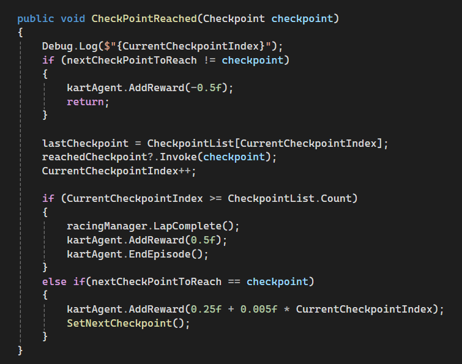

# Kart Racer - Round Table Games


## Gemaakt door:

- Afissou Arigbe s127856
- Keanu Segers s131155
- Marwan Benali s129511

## Round Table Kart
Een racing game waarbij de tegenstanders bestuurd worden doormiddel van Machine Learning. De speler bestuurd een kart en probeert zo snel mogelijk een ronde te voltooien, 
terwijl de AI-tegenstanders moeten navigeren zonder van de baan te raken. 
De Agents worden getrained om zo min mogelijk van de baan te vliegen en zo snel mogelijk een ronde te halen. 

In deze tutorial leggen wij uit hoe je dit project werkend kan krijgen op jouw systeem zodat jij een nieuwe training model kan creëren. 
Daarnaast leggen we ook uit welke objecten wij gebruiken, de observaties en rewards van de Agent en onze eigen resultaten.


## Vereisten
### Windows
- Unity version: 2022.3.26f1
- ML Agents Unity Package: 2.0.1
- Anaconda
  - Environment with Python: 3.9.18
  - PyTorch: 1.7.1
  - Protobuf 3.20.*
  - ML Agents 0.30.0

## Installatie
1. Kloon dit project op je PC
2. Voeg dit project toe aan Unity Hub en open het
3. Klik in Unity op Window > Package Manager
4. Klik op "Packages: In Project" en kies Unity Registry
5. Zoek naar "ML Agents" en druk op installeren (aanbevolen versie 2.0.1)
6. Klik in de Project Explorer op Scenes en open TrackFinished
7. Druk op "Play" om het voorgetrainde model te testen.
### Nieuw model trainen:
1. Open Anaconda Prompt
2. Activeer een omgeving met Python versie 3.9.18
3. Navigeer in Anaconda Prompt naar de hoofdmap van het Unity Project (met mappen Assets & config)
4. Start het training proces met dit commando:
    
    ```bash
    mlagents-learn config/KartAgent.yaml --run-id=NewKartAgent
    ```
5. Druk in Unity op "Play". Als je de Agents veel sneller ziet racen dan normaal, dan is de training begonnen.
6. Gebruik in een ander Anaconda Prompt-venster, na het herhalen van stap 2 & 3, het volgende commando om Tensorboard te bekijken:
 
    ```bash
    tensorboard --logdir results
    ```
## Gameplay Uitleg

## Objecten

Hier is de Kart die gebruikt word door de speler:

<br><sub><sup>*Mixandjam. (n.d.). GitHub - mixandjam/MarioKart-Drift*.</sup></sub>

Dit is de Kart die door ML Agents getrained word om zelf door de circuit de racen:

<br><sub><sup>*Mixandjam. (n.d.). GitHub - mixandjam/MarioKart-Drift*.</sup></sub>

Dit is de circuit waar de speler en de agents op racen. Er zijn barrières geplaatst op meerdere plekken om te voorkomen dat de racers
verkeerd rijden.

<br><sub><sup>*Cartoon Race Track - Oval | 3D Roadways | Unity Asset Store. (2021, February 12). Unity Asset Store. https://assetstore.unity.com/packages/3d/environments/roadways/cartoon-race-track-oval-175061*.</sup></sub>

## Agent Observaties, Mogelijke Acties en Beloningen

De Agent heeft twee verschillende acties: Accelereren en sturen. De Agent kan ook achteruit rijden, maar krijgt daarvoor wel een penalty, dus word het alleen gebruikt bij noodgevallen.

<br><sub><sup>*Sebastian-Schuchmann. (n.d.). GitHub - Sebastian-Schuchmann/AI-Racing-Karts*.</sup></sub>

De Agent kan observeren waar de volgende checkpoint is. Eenmaal wanneer een checkpoint bereikt is door de Agent, checkt de Agent of de checkpoint de volgende in de lijst is. 
Als dat zo is, dan krijgt de Agent een reward van 0.25f + bonus reward voor hoe snel de Agent was voor het bereiken van de checkpoint.
Als de de checkpoint de laatste checkpoint is in de lijst, dan heeft de Agent een lap complete en krijgt de Agent een reward van 0.5f, en word de Episode geëindigd. 

<br><sub><sup>*Sebastian-Schuchmann. (n.d.). GitHub - Sebastian-Schuchmann/AI-Racing-Karts*.</sup></sub>

De Agent krijgt een penalty als die een muur raakt of van de weg vliegt en een reward als de Agent op de weg blijft.


## One Pager


## Tensorboard waarnemingen

Hier zijn de resultaten na het trainen van de Agent.

Zoals je kan zien zijn er veel spikes bij de Cumulative Reward. Dit komt omdat we de Agents veel tijd gaven voordat de Episode vanzelf eindigd. Dit geeft de Agent meer tijd om
een lap te halen (dit is terug te zien in Episode Length), maar daarnaast betekent het ook dat als de Agent een nieuwe manier probeert om rewards te krijgen (bijvoorbeeld de circuit andersom rijden, wat natuurlijk niet de bedoeling is) 
dat de cumulatieve reward een stuk lager komt te zijn dan het gemiddelde. Een oplossing voor dit is door de rewards zodanig aan te passen dat het verschil tussen de hoogste en laagste punt niet 
te groot is. 

Desalniettemin hebben wij wel goede resultaten gekregen na het trainen van de Agents en proberen ze zo veel mogelijk (en zo snel mogelijk) op de weg te rijden.


## Conclusie 
Ons doel was het maken van een immersieve kart racing experience waarin de speler aan het racen is tegen AI getrainde tegenstanders.

Dit was ons gelukt met behulp van ML Agents, waarbij de Agent positieve en negatieve feedback krijgt aan de hand van zijn gedrag. 
Hoe sneller en netter de Agent door de circuit rijd, de meer positieve reward hij krijgt. 
En hoewel resultaten in grafieken één ding zijn, ligt het belangrijkste gedeelte in de ervaring van de speler. Wat we hieruit terug kregen zijn AI getrainde tegenstanders die
een interessante maar ook uitdagende gaming experience geven en racen zoals verwacht word van de speler.

Als het gaat om verbeteringen, zijn wij van plan meer focus te zetten op het optimaliseren van de reward systeem, meerdere moeilijkheidsgraden toe te voegen en meerdere verschillende karts toe te voegen met andere controls en snelheden.
